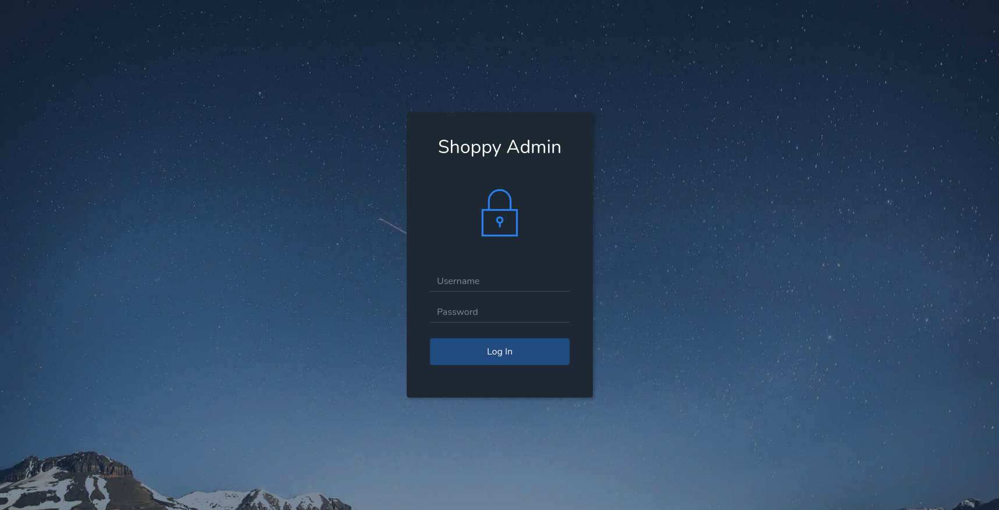
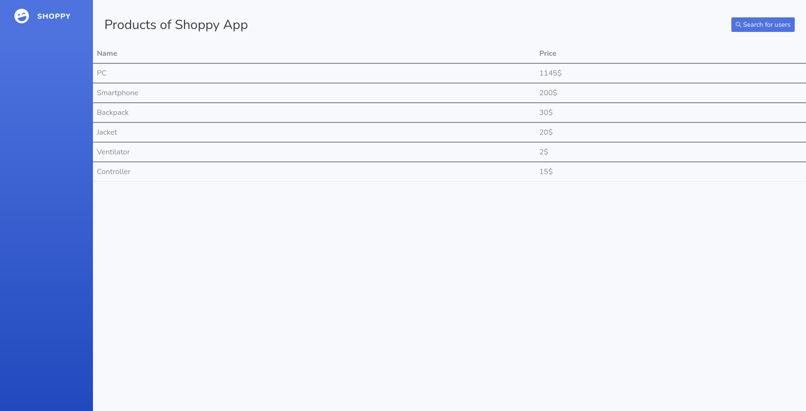
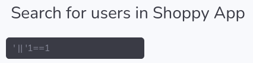
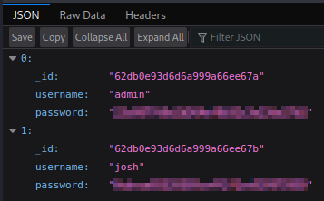
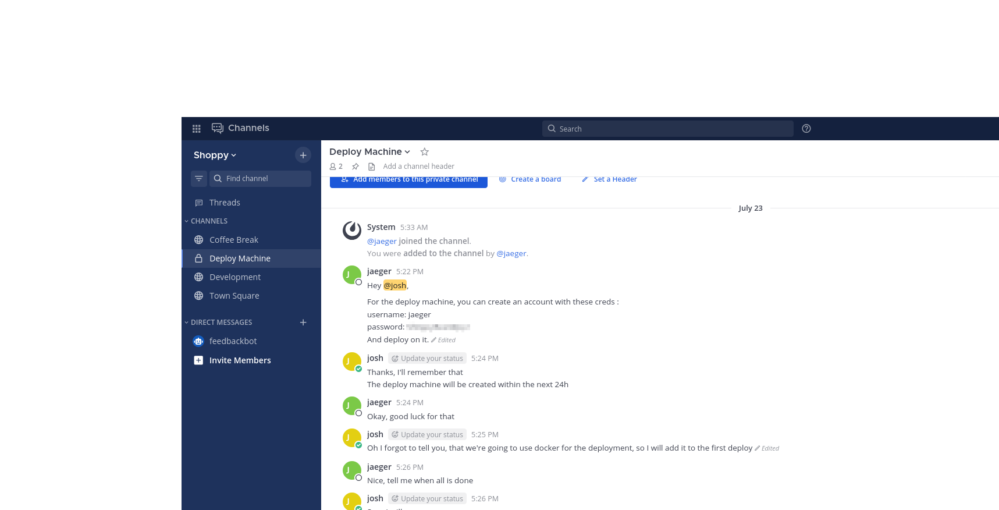
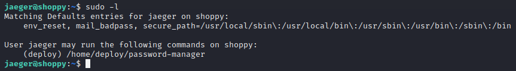
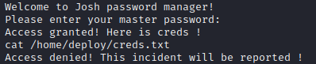
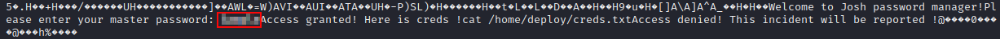
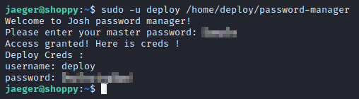
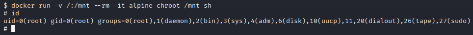

# Shoppy


## Enumeration

[Initial scans](scans/initial_scan.nmap) show Nginx is running on port 80 and that the target is probably using the domain *shoppy.htb*.  Let's add this to our local /etc/hosts file.  Browsing to the site shows a countdown page:


ZAP doesn't turn up much, except a possibly exploitable version of jQuery (1.10.2).  Let's keep this in mind in case we get desperate.

A [first pass with ffuf](scans/ffuf-shoppy.md) finds some interesting directories: admin/, login/, and export/.  Browsing directly to admin/ redirects to login/; which, shockingly, provides a login page:



Directory listing is disabled, so we can't see inside the export/ directory.

We haven't yet come across a username or password we might be able to use to log in, but some basic testing turns up a couple of interesting results:

1. When entering invalid credentials, a message is displayed that says *Wrong Credentials*.  At the same time, a GET parameter appears in the URL: /login?error=WrongCredentials.  If we change this to /login?error=*test*, the error message disappears and our input is not reflected in the response.  So *WrongCredentials* is likely the key for an array or index.
2. Entering *admin'#* in the username field, and any random string for the password, results in a *504 Gateway Time-out* error.  This indicates that there's probably a SQL injection vulnerability here that we'll want to explore further.

`sqlmap` didn't get any results.  Just a bunch of errors, in fact.  Likewise, using OWASP ZAP with the sqli.auth.bypass.txt seclist to fuzz for vulnerabilities turned up nothing.  Supposing the target could be using a NoSQL database, I turned to [HackTricks](https://book.hacktricks.xyz/pentesting-web/nosql-injection) and, after a little trial and error, found a string that works: `admin' || '1==1//`.



There's not much on the admin page except the *Search for users* button; which, when clicked, takes us through to a search form.  If we enter a variation of the string that got us access to the admin page here, we are presented with a download button that leads to a file called *export-search.json* that contains a list of usernames and passwords.





josh's password can be cracked in under a second (on my machine) using `hashcat`:

```
hashcat -m 0 -a 0 <hash> /usr/share/seclists/Passwords/Leaked-Databases/rockyou.txt
```

The admin password is not in the rockyou.txt list, so `hashcat` yields no results for that one.

We now have a set of credentials, but nothing with which to use them.  [Subdomain fuzzing](scans/ffuf-shoppy_subdomains.md) might solve this problem for us, though, as `ffuf` comes up with a valid subdomain: *mattermost*.

After adding *mattermost.shoppy.htb* to the local /etc/hosts file and browsing to the site, we are met with another login page:


The credentials we recovered earlier (username *josh*) allow us access, and a qucik Google search tells us that Mattermost is an "open source platform for developer collaboration."  Not that it really matters, though, as we already have access.


## Initial Foothold

A quick look around reveals a chat history that includes credentials for the "deploy machine."



Using these, we are able to SSH in to the target machine and grab the user flag.


## Privilege Escalation

As usual after gaining access to a shell account, first run `sudo -l` to see if there's any low-hanging fruit that can be exploited to escalate our privileges.  In this case, it shows that jaeger can run /home/deploy/password-manager as user deploy:



In the Mattermost Development channel, josh mentions that he wrote this password manager while learning C++, so we can assume it's no masterpiece and is likely easily exploitable.  Running `sudo -u deploy /home/deploy/password-manager` produces a prompt to enter a master password.  We don't know what the master password is, but it's probably hardcoded in the application.  `strings /home/deploy/password-manager` shows some interesting output, but nothing that looks like a password:



We can see that, after entering the correct password, the program tries to `cat` the /home/deploy/creds.txt file.  This suggests that the password comparison operation takes place at this point in the code, so let's have another look using `cat /home/deploy/password-manager`:



This time, we see some extra text following the *Please enter your master password:* prompt that could very well be the password we're after.  Run the `password-manager` app again and supply this string as the password.



Success!  The text recovered from the `password-manager` code is, indeed, the master password and grants us access, displaying a new set of credentials for the deploy user.

After logging in to the deploy account, we again run `sudo -l`.  Unfortunately, this user has no sudo privileges.  However, it was also mentioned in the Mattermost chat that Docker would be used for deployment.  `groups` shows that the deploy user is a member of the *docker* group, so we may be able to get a root shell using [this trick from GTFOBins](https://gtfobins.github.io/gtfobins/docker/#shell):



It worked.  We can now go grab the root flag.